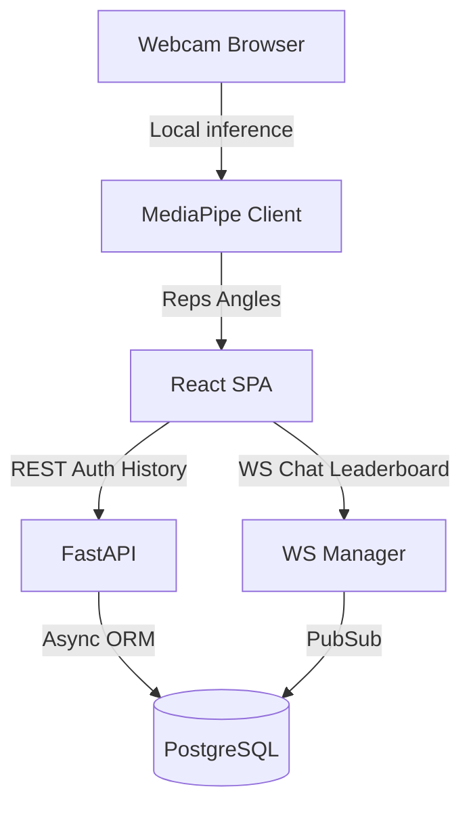
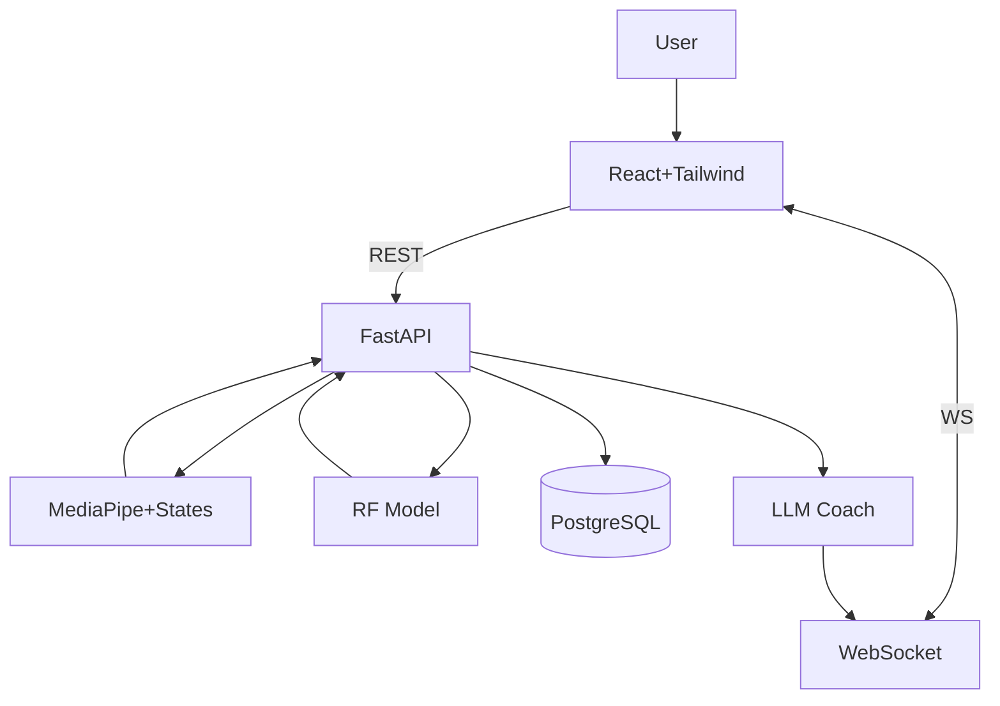
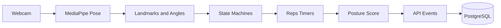
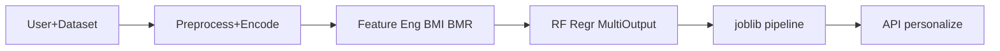
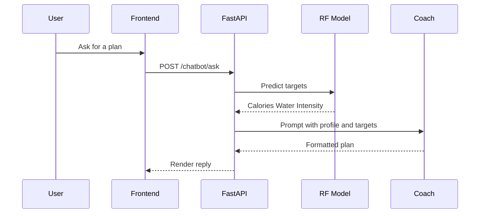
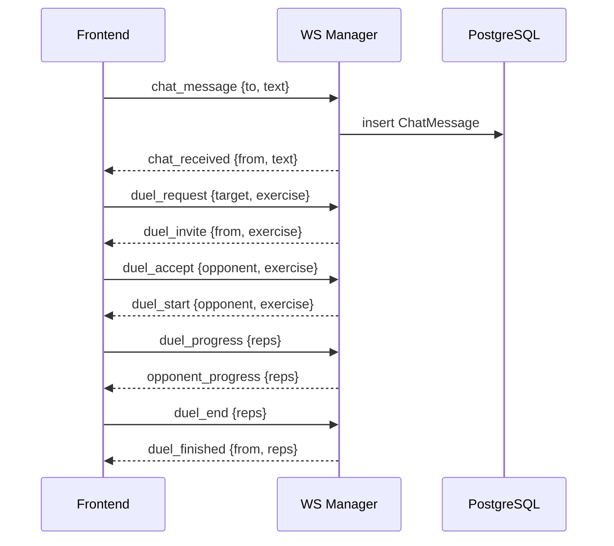
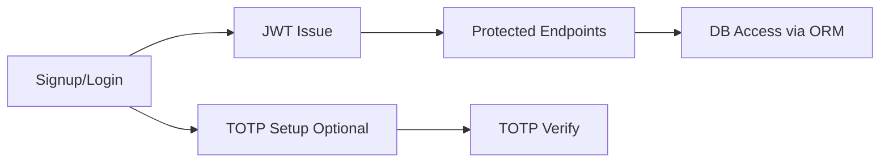
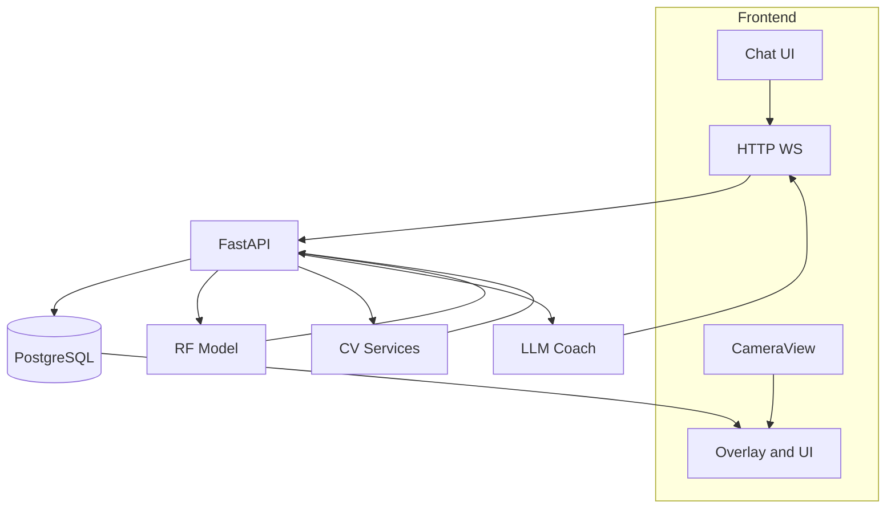

# Architecture

This document contains the detailed system design and technical architecture for the AI Fitness Tracker. It centralizes deep explanations and diagrams so that the README remains clean and high‑level.

---

## Conceptual Architecture (Simplified)

---

## High‑Level Architecture

Components
- React frontend: UI, camera access, and live overlays
- FastAPI backend: APIs, auth, orchestration, and persistence
- MediaPipe: real‑time landmarks in the browser, passed as events
- RF Model: multi‑output regressor for personalization targets
- LLM Coach: context‑aware, formatted coaching outputs
- PostgreSQL: durable storage for users, workouts, and social features

---

## Computer Vision Pipeline

Details
- Landmark detection: MediaPipe yields stable 2D/3D joint coordinates at real‑time FPS
- State machines: Angle thresholds and phase transitions for dynamic movements and static holds
- Posture scoring: Penalizes joint deviations from expected form windows
- Events: Aggregated metrics are sent to the backend for storage and analytics

---

## ML Personalization Pipeline

Targets
- calories: BMR driven with activity factor
- water: mass and session duration based
- intensity: experience‑level aware

Notes
- Handles missing values, encodes categoricals, adds engineered features (BMI, BMR)
- Prints MAE and RMSE; persists a joblib pipeline
- Fallback rules used if the model is not available

---

## Chatbot and AI Reasoning Flow

Formatting
- Strict sectioned bullets for Workout, Diet, Hydration, Explanation
- Deterministic fallback used when LLM is unavailable

---

## Real‑Time Social and Gamification (WebSockets)

---

## Auth and Security Flow

---

## Full System Data Flow

---

## Design Decisions

- MediaPipe vs CNN  
  - Avoids GPU dependency and heavy inference costs  
  - Achieves real‑time performance in the browser

- Random Forest for personalization  
  - Works well with structured features and small data  
  - Minimal tuning and fast inference

- Hybrid approach  
  - CV for signal, state machines for explainable logic  
  - RF for personalization targets, LLM for contextual guidance

---

## Scalability and Performance

- Async FastAPI with efficient I/O boundaries  
- WebSockets for bi‑directional, low‑latency interactions  
- Modular architecture: independent CV, ML, and LLM services  
- Rule‑based fallbacks keep core features online

---

## Future Architecture Improvements

- Multi‑agent coaching roles (form, pacing, motivation, recovery)  
- Reinforcement learning for adaptive program progression  
- Mobile deployment with on‑device lightweight models  
- Federated learning to personalize without centralizing data
